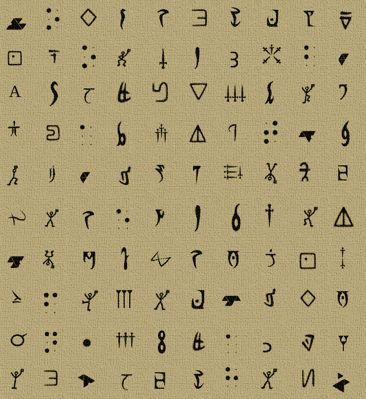

# Misc / Babel

## Challenge
You found these two files in a dead drop. Decipher it.

## Inputs:
- [message.png](./message.png)
- [unknown.txt](./unknown.txt)


## Solution
Here's what the first file looks like:



We recognize some braille characters, that's about it. We need to identify the other alphabets that are used there.

Here are the esoteric languages that we patiently discover using dCode:
- Covenant (Hallo)
- Braille
- Gravity Falls
- Guerudo
- Daedrique
- Hyllian
- Iokharique
- Bonhomme dansant
- Dorabella
- Dothraki
- Cunéiforme

Decoding:
```
CoNGRATULA
TIoNsTOobT
AIhTHEflAG
GRaBaLLtHE
BYTESInTHE
SEReNTHcOL
LUMNFROMTh
EfIlEUNKNO
Wn.tXPaNDs
HAOhEThESE
```

Interpretation:
```
CoNGRATULATIoNs TO obTAIh THE flAG GRaB aLL tHE BYTES In THE SEReNTH cOLLUMN FROM ThE fIlE UNKNOWn.tXT aND sHAOhE ThESE
```

So we basically need to SHA1 the 7th column from unknown.txt

```console
$ cat unknown.txt
a e g f e d l D E F u N 5
e g D c G j A 0 h r X T [
5 2 D n B _ g l z _ V T [
4 P o d _ 8 p _ o e w A V
p F k e r k T ? K z _ 0 m
_ 0 0 e c r a s D _ p I 0
I s e n D A [ n L H M & p
p O _ 0 G Y l c r d ~ 0 C
E g 4 e F o 3 0 G 5 W p 5
H L J _ f r a j 0 0 D C V
$
$ echo -n  lAgpTa[l3a | sha1sum
128a64805be78e21dddb3aa3c7d72aecd7ee162d  -
```

## Flag
ECW{128a64805be78e21dddb3aa3c7d72aecd7ee162d}
